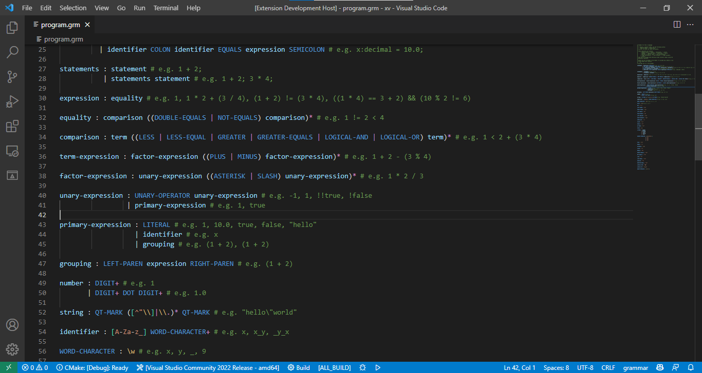

# Grammar Syntax

This extension adds syntax highlighting for `.grm` files.

## Features

+ Comments
+ Variable tokens
+ Constant tokens
+ Simple RegEx highlighting

### Preview



## Syntax

### Basic syntax

You can define a rule using this syntax:
```
rule-name : <rule content>
```
You should only use lowercase letters and **-** (hyphen) in naming a rule.

To define a constant token, use this syntax:
```
CONSTANT-TOKEN : "<token>"
```
or
```
CONSTANT-TOKEN : <regex-here>
```
Use capital letters and **-** (hyphen) for naming a constant token. You need to surround the token with quotes **except when using RegEx**. You also must escape the special RegEx characters. You can also use RegEx in defining a constant token. Learn more about RegEx [below](#regular-expressions).

Lastly, you can provide alternate rules using the pipe (**|**) symbol.

Here is a rule that matches a integer OR a floating-point number:

```
DIGIT : \d
DOT : "\."

int-or-float : DIGIT+
             | DIGIT+ DOT DIGIT+ # alternatively, match one or more digits, a dot, and one or more digits
```
<sup>Yes, I know it can still be simplified.</sup>

### Regular expressions

You can use RegEx syntax such as `*`, `+`, character classes, capture groups, and more.

For example, to define a constant token that matches any length of letters (including underscore) or numbers:

```
LETTERS-OR-NUMBERS : [\w\s]+
```

You can also use RegEx for recursion. For example, here is a rule that matches a term at least once:

```
DIGIT : \d
DOT : "\."
ADD : "\+" # escaped because + denotes 1 or more in RegEx
SUB : "-"

number : DIGIT+ # match one or more digits 0-9
       | DIGIT+ DOT DIGIT+

term-expr : term-expr ((ADD | SUB) term-expr)*
          | number
```

## Release Notes

### 1.0.0

Initial release of Grammar Syntax.
